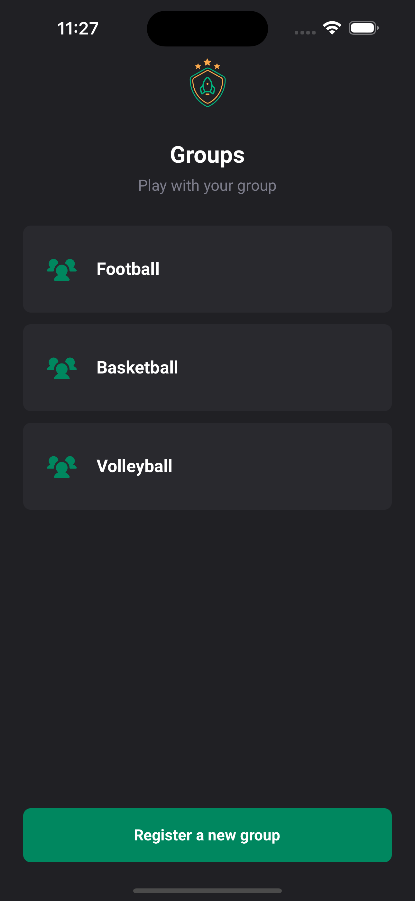

# Friend-Groups-App


Friend-Groups-App is a React Native application developed with Expo. This introductory application showcases several modern development concepts and practices.

## Table of Contents

- [Features](#features)
- [Tech Stack](#tech-stack)
- [Screenshots](#screenshots)
- [Installation](#installation)
<!--
- [License](#license)
-->
## Features

- Create and manage groups.
- Add different teams to each group.
- Add players to each team.
- Data is persisted using local storage.

## Tech Stack

- [React Native](https://reactnative.dev/) with [Expo](https://expo.dev/)
- [Typescript](https://www.typescriptlang.org/)
- [React Navigation](https://reactnavigation.org/)
- [Styled Components](https://styled-components.com/)
- [Google Fonts](https://fonts.google.com/) with font loading strategy

## Screenshots




## Installation

To install and run this application:

```bash
# Clone the repository
git clone https://github.com/JulioCesarTeixeira/friend-groups-app.git

# Navigate to the project directory
cd friend-groups-app

# Install dependencies
npm install

# Start the application
expo start
```

<!--
## License

This project is licensed under the terms of the MIT license. See [LICENSE](LICENSE.md) for more details.
-->
